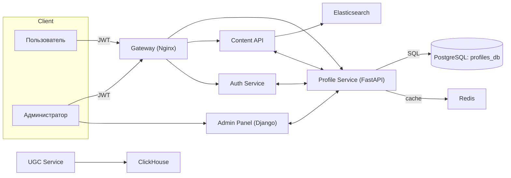
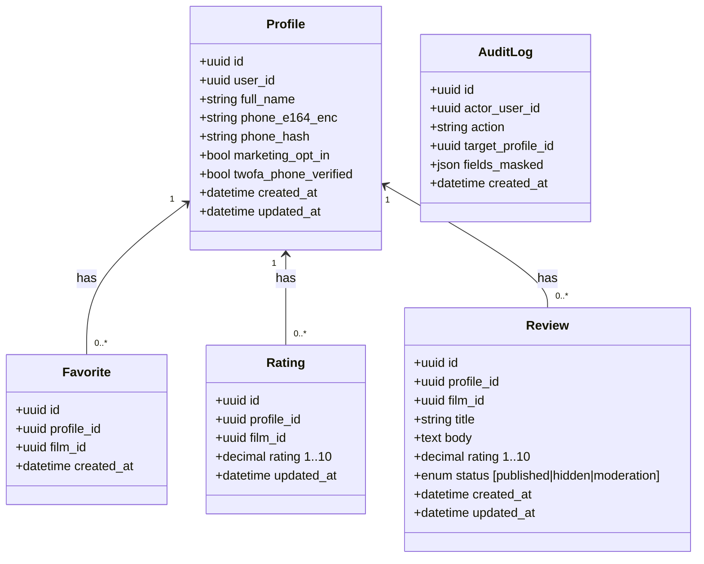
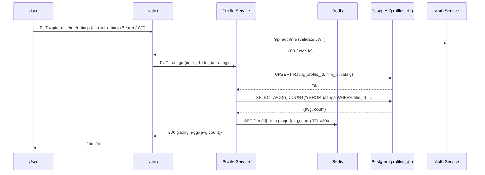
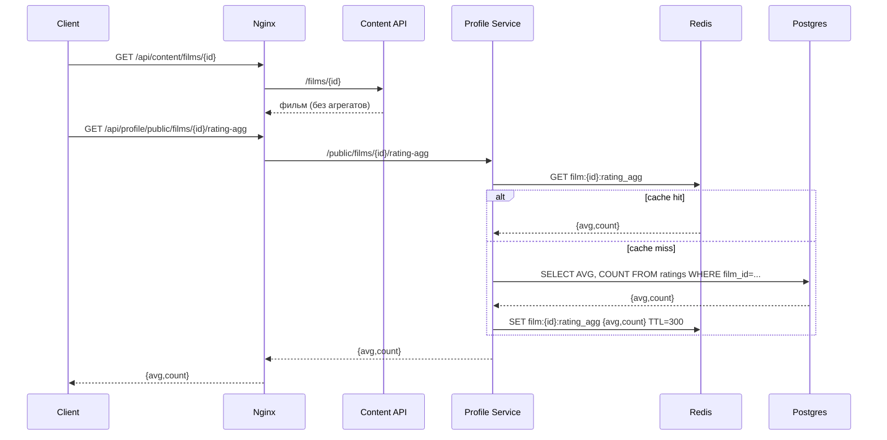
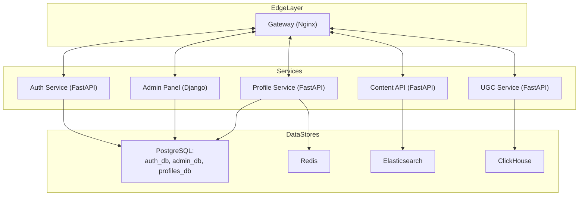

# Профили пользователей — требования, архитектура и UML

> Документ описывает новый **Profile Service** для монорепозитория *Online Cinema* и его встраивание в существующую систему.

## Оглавление
1. [Функциональные требования](#функциональные-требования)
2. [Нефункциональные требования](#нефункциональные-требования)
3. [Архитектура нового сервиса](#архитектура-нового-сервиса)
4. [UML нового сервиса](#uml-нового-сервиса)
5. [UML всего проекта](#uml-всего-проекта)

---

## Функциональные требования

### 1. Управление профилем (CRUD)
- Создание, чтение, обновление, удаление **профиля** пользователя.
- Поля профиля (PII):
  - `user_id` (из Auth Service)
  - `full_name` (ФИО)
  - `phone_e164` (строго в формате E.164, валидация)
  - `marketing_opt_in` (согласие на рассылки), `2fa_phone_verified` (флаг верификации телефона)
  - служебные поля: `created_at`, `updated_at`
- Уникальность: один активный профиль на `user_id`; **уникальный номер телефона** (см. безопасность ниже).
- Доступ:
  - **Владелец** видит/правит свой профиль.
  - **Администратор** с правом `profiles.view_sensitive` видит PII любых профилей.
  - **Остальные** — запрещено видеть PII.

### 2. Избранные фильмы
- Добавить/удалить фильм в избранное (`favorites`).
- Вывести список избранных; пагинация, сортировка по дате добавления.
- Идемпотентность: повторное добавление не должно дублировать запись.

### 3. Рейтинги фильмов
- Поставить/обновить персональный рейтинг фильму в диапазоне `1..10` (шаг 0.5).
- Получить свой рейтинг для конкретного фильма.
- Агрегированные метрики для фильма:
  - `avg_rating`, `ratings_count` — публичные агрегаты для отображения на карточке фильма.
  - Кэширование агрегатов в Redis (TTL, например 5 мин). Инвалидация при изменении рейтинга.

### 4. Рецензии (отзывы)
- Создать, читать, обновить, удалить **свою** рецензию к фильму (одна активная рецензия на пользователя и фильм).
- Поля: `title?`, `body`, `rating?` (можно отдельно от «оценки» из п.3), `status` (`published|hidden|moderation`).
- Публичный просмотр списка рецензий по фильму (без PII автора; отображаем псевдоним или user_id, если псевдонима нет).
- Модерация: администратор может скрыть/разрешить рецензию.

### 5. Интеграции
- **Auth Service**: все эндпоинты требуют JWT; `user_id` берём из токена.
- **Content API**: эндпоинт для получения агрегатов рейтинга и последних рецензий по фильму.
  - `/api/profile/public/films/{film_id}/rating-agg` → `{avg_rating, ratings_count}`
  - `/api/profile/public/films/{film_id}/reviews?limit=...`
- **Admin Panel (Django)**: read-only просмотр профилей и PII только для ролей с правами.
  - Доступ через отдельную БД или схему Postgres (multi-DB в Django), либо через административные API Profile Service.
- **UGC** (опционально): при событиях «просмотр/лайк» можно создавать записи избранного или подсказывать рекомендации (вне текущего скоупа).

### 6. Аудит и отчётность
- Журналирование действий с PII: кто, когда, к какому `user_id` обращался (owner/admin), какие поля менялись.
- Экспорт агрегатов рейтинга для аналитики (API или выгрузка).

### 7. Миграции/инициализация
- Автоматическое создание схемы БД при старте контейнера (alembic/SQL миграции).
- Сидирование тестовых данных (опционально — для стендов).

---

## Нефункциональные требования

### Безопасность и соответствие
- Хранение PII:
  - `phone_e164_enc` — **шифрование** на уровне приложения (AES-256-GCM) или `pgcrypto` (AES) в Postgres.
  - `phone_hash` (SHA-256 + pepper) — для **уникальности и поиска**; хранится и индексируется, уникальный индекс по `phone_hash`.
- Валидация телефона: только E.164; нормализация с учётом кода страны.
- Контроль доступа: RBAC, принцип минимально необходимых прав.
- Журналы доступа к PII, маскирование в логах.
- Защита API: JWT + rate limit (например, 60 rps / пользователь; 10 rps / IP для публичных).
- Политика удаления: `soft delete` профиля; безвозвратное удаление по запросу (включая каскад в favorites/ratings/reviews).
- Резервное копирование БД (ежедневно, хранение ≥30 дней), шифрование бэкапов.
- Срок хранения PII — по политике компании/закону; наличие механизма **экспорта** и **удаления** данных по запросу пользователя.

### Надёжность и производительность
- Доступность сервиса: **99.9%** на проде.
- Время отклика p95: **< 100–150 мс** для CRUD; агрегаты — < 200 мс (при попадании в кэш — < 50 мс).
- Горизонтальное масштабирование по HTTP (stateless), sticky не требуется.
- Идемпотентность операций добавления в избранное и выставления рейтинга.
- Наблюдаемость: метрики (Prometheus), трассировки (OTel), структурированные логи (JSON).

### Качество
- Тесты: unit + интеграционные (минимум CRUD и агрегации).
- Миграции версионированы, откатываемы.
- Документация OpenAPI, примеры запросов, Postman-коллекция.

---

## Архитектура нового сервиса

**Profile Service** (FastAPI + PostgreSQL (+ Redis для кэша)):
- БД: `profiles_db` (в рамках общего контейнера Postgres, отдельная БД или схема `profiles`).
- Основные таблицы:
  - `profiles` — профиль (PII)
  - `favorites(profile_id, film_id, created_at)` — уникальный ключ `(profile_id, film_id)`
  - `ratings(profile_id, film_id, rating, updated_at)` — уникальный ключ `(profile_id, film_id)`
  - `reviews(profile_id, film_id, title?, body, rating?, status, created_at, updated_at)` — уникальный ключ `(profile_id, film_id)`
  - `audit_logs(id, actor_user_id, action, target_profile_id, fields_masked, created_at)`
- Кэш Redis:
  - `film:{film_id}:rating_agg -> {avg,count}` (TTL 300s)

**Основные эндпоинты (черновик):**
- `/api/profile/me` — получить свой профиль
- `/api/profile` (POST/PUT/DELETE) — CRUD своего профиля
- `/api/profile/me/favorites` (GET/POST/DELETE)
- `/api/profile/me/ratings` (GET/PUT)
- `/api/profile/me/reviews` (GET/POST/PUT/DELETE)
- Публичные агрегации:
  - `/api/profile/public/films/{film_id}/rating-agg` (GET)
  - `/api/profile/public/films/{film_id}/reviews` (GET, пагинация, сортировка)
- Админка (через Django или /admin API, только с `profiles.view_sensitive`):
  - `/api/profile/admin/search?phone=...` (ищет по `phone_hash`), `/api/profile/admin/{user_id}` (полный просмотр)

### Диаграмма компонентов (новый сервис в контексте)


---

## UML нового сервиса

### 1) Class Diagram (модель данных профилей)


### 2) Sequence Diagram — добавление рейтинга


### 3) Sequence Diagram — публичное чтение агрегатов на карточке фильма


---

## UML всего проекта

### Component Diagram — интеграция нового сервиса


---

### Мини-спецификация API (черновик)

**Auth:** Bearer JWT из Auth Service во всех приватных эндпоинтах.

**Профиль**
- `GET /api/profile/me` → 200 {profile}
- `POST /api/profile` `{full_name, phone}` → 201 {profile}
- `PUT /api/profile` `{full_name?, phone?, marketing_opt_in?}` → 200 {profile}
- `DELETE /api/profile` → 204

**Избранное**
- `GET /api/profile/me/favorites?limit&offset` → 200 {items:[{film_id,added_at}], total}
- `POST /api/profile/me/favorites` `{film_id}` → 200/201
- `DELETE /api/profile/me/favorites/{film_id}` → 204

**Рейтинги**
- `GET /api/profile/me/ratings?film_id?` → 200
- `PUT /api/profile/me/ratings` `{film_id, rating}` → 200 {rating}
- `GET /api/profile/public/films/{film_id}/rating-agg` → 200 {avg_rating, ratings_count}

**Рецензии**
- `GET /api/profile/public/films/{film_id}/reviews?limit&offset&sort=recent|top` → 200
- `POST /api/profile/me/reviews` `{film_id, title?, body, rating?}` → 201
- `PUT /api/profile/me/reviews/{film_id}` → 200
- `DELETE /api/profile/me/reviews/{film_id}` → 204
- Админ: `PUT /api/profile/admin/reviews/{id}/status` `{status}`

**Админ-доступ к PII**
- `GET /api/profile/admin/search?phone=...` (поиск по телефону; ищем по `phone_hash`, возвращаем PII только с правом)
- `GET /api/profile/admin/{user_id}` → полный профиль + активности

---

### Модель данных (SQL-эскиз)
```sql
create table profiles (
  id uuid primary key default gen_random_uuid(),
  user_id uuid not null unique,
  full_name text not null,
  phone_e164_enc bytea not null,        -- шифротекст
  phone_hash bytea not null unique,     -- sha256(pepper + e164)
  marketing_opt_in boolean default false,
  twofa_phone_verified boolean default false,
  created_at timestamptz default now(),
  updated_at timestamptz default now()
);

create table favorites (
  id uuid primary key default gen_random_uuid(),
  profile_id uuid not null references profiles(id) on delete cascade,
  film_id uuid not null,
  created_at timestamptz default now(),
  unique(profile_id, film_id)
);

create table ratings (
  id uuid primary key default gen_random_uuid(),
  profile_id uuid not null references profiles(id) on delete cascade,
  film_id uuid not null,
  rating numeric(3,1) not null check (rating >= 1 and rating <= 10 and rating*2 = floor(rating*2)),
  updated_at timestamptz default now(),
  unique(profile_id, film_id)
);

create table reviews (
  id uuid primary key default gen_random_uuid(),
  profile_id uuid not null references profiles(id) on delete cascade,
  film_id uuid not null,
  title text,
  body text not null,
  rating numeric(3,1),
  status text not null default 'published' check (status in ('published','hidden','moderation')),
  created_at timestamptz default now(),
  updated_at timestamptz default now(),
  unique(profile_id, film_id)
);

create table audit_logs (
  id uuid primary key default gen_random_uuid(),
  actor_user_id uuid not null,
  action text not null,
  target_profile_id uuid not null,
  fields_masked jsonb not null,
  created_at timestamptz default now()
);
```

---

## Примечания по внедрению

- **Django Admin**: добавить app `profiles_admin` с моделями из `profiles_db` (через `DATABASE_ROUTERS` или `DATABASES['profiles']`). Права: `profiles.view_sensitive`, `profiles.change_review`, `profiles.moderate_review`.
- **Content API**: для карточки фильма запрашивать агрегаты рейтингов напрямую у Profile Service (кэширует Redis). В дальнейшем можно реплицировать агрегаты в ES отдельной задачей.
- **Миграции**: Alembic в Profile Service, Django — отдельно для админки.
- **Секреты**: ключи шифрования PII хранить в Secret Manager/ENV (не в git).

---

_Версия документа: 1.0_
